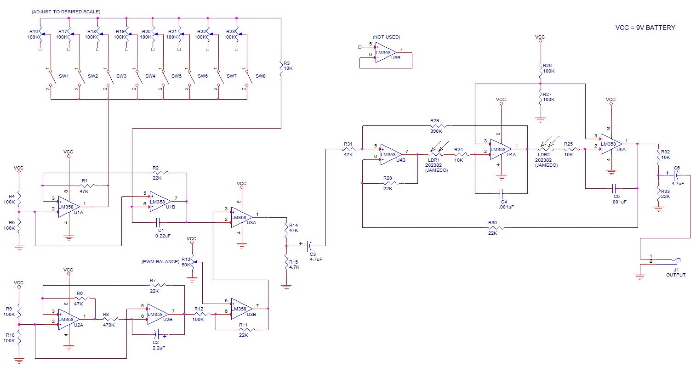
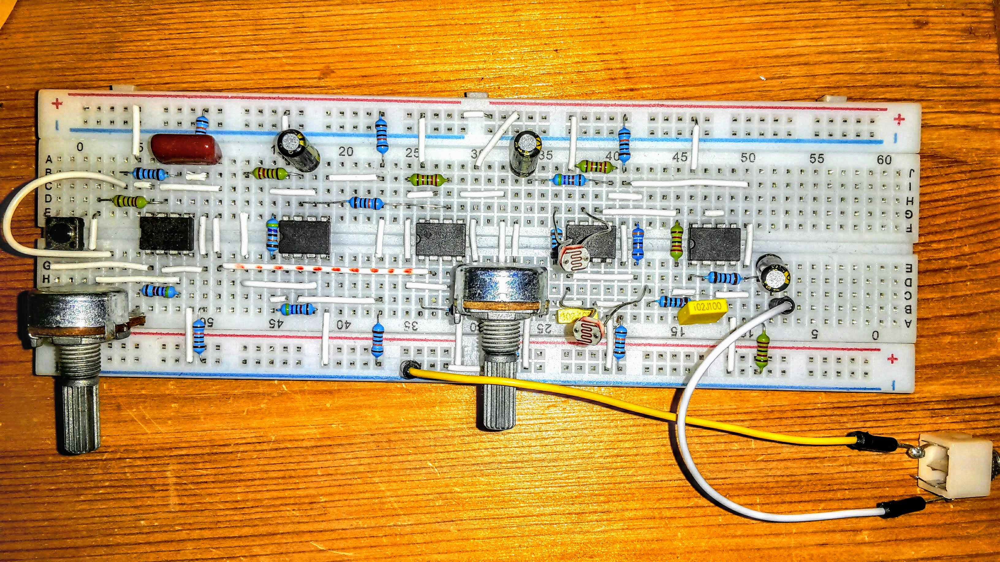

# LM358synth
Pete McBennet's "simplest DIY"  dual oscillator synth at [https://www.youtube.com/watch?v=yZSkNASlMjM]. See also [https://www.youtube.com/watch?v=wPeH6KfH8RY] for layout on a breadboard. And [https://www.youtube.com/watch?v=GxnAC2Ivmbs]. There's another demo by Slider2732 at [https://www.youtube.com/watch?v=GxnAC2Ivmbs] which has another schematic that may be useful.

Schematic from [https://drive.google.com/file/d/0Bzxodk3UiKRgSXc0OVBWQnNfM00/view]

PCB also available at [https://www.pcbway.com/project/shareproject/Portable_LDR_Synthesizer_by_Jason_Cox.html]

## BOM
#### Resistors:

- 47k:		R1 ,R6 ,R14 ,R31
- 22k:		R2 ,R7 ,R11 ,R28 ,R30 ,R33
- 10k:		R3 ,R24 ,R25 ,R32
- 100k:	R4 ,R5 ,R9 ,R10 ,R12 ,R26 ,R27
- 470k:  R8
- 4k7:   R15
- 390k:  R29

#### Pots, buttons etc:

- 50k pot: R13 - PWM balance
- 100k pot: R16-R23 - key tuning - *(Breadboarded with 1 'key' only!)*
- pushbutton, momentary: SW1-SW8 - *(Breadboarded with 1 'key' only!)*
- 2022382 jameco (10k): LDR1 & LDR2 - *For control of the filter by shading with hand/pot etc.*

#### ICs:

- LM358: U1-U5

#### Capacitors:

- 0u22F:  C1 					
- 0u001F: C4,C5  				

*Electrolytics:*

- 2u2F:  C2
- 4u7F:  C3
- 4u7F:  C6

## Notes on the circuit. 

I'm not sure where the little squares in the circuit diagram should be connected. Maybe they aren't connected at all... 

[https://e2e.ti.com/blogs_/archives/b/thesignal/archive/2012/11/27/the-unused-op-amp-what-to-do]

... Having implemented it, this is correct - or correct enough!

## Notes from youtube comments:

### About the Circuit

- (Pete McBennet) This is a pulse width modulated oscillator, routed through a light-controlled resonant low pass filter. My objective was to produce a true synth sound with minimum parts count and all commonly available parts. By "true synth sound"  I mean FAT dual oscillator tonality (via PWM) and a sweet high-resonance low pass filter. The light-control aspect gives amazing musical expression, as seen in the video clip. Made from all generic op-amps. (LM358, LM1458, LM741 all work equally well.) It can be tuned to any scale via the eight tunable potentiometers. Through a nice amp it absolutely GROWLS with earth-shaking bass frequencies.

- (Pete McBennet) The output of U2B is the low-frequency oscillator or LFO. 1Hz is about right. It is used to slowly sweep the pulse width of the audio frequency oscillator, which is U1.

- (Pete McBennet)  R19 and R20 can be a dual-ganged 1 meg-ohm pot. (Mouser Part #: 31VW601-F) I already did exactly what you are asking, and made a stand-alone filter box with a knob to sweep the cutoff frequency. Works great. Reverse the polarity of C3 and that becomes the input. R27 and R28 are optional, all you would need on the output is C6. Also, you can adjust R23 to control resonance. However, the cutoff frequency will not sweep down to sub-bass like the LDR's will. Still sounds good though. Here is what the filter sounds like with the dual potentiometer:[https://www.youtube.com/watch?v=PfeWkbqDdqU]

- (Pete McBennet)  you must realize that the tone oscillator is NOT a true VCO. It uses varying resistances as opposed to varying voltages to select the pitch. This is how I kept the design "simple". Yes, "simple" is a relative term, I have been at this shit for too long apparently. The sequencer that I have used on this circuit utilized (among other things) two analog switch IC's (CD4016) to take the place of the eight key-switches.

### Mods

- (Adamski A) I did a similar thing on mine where i used two diffrent caps on the output and used a pot to blend between 1 or the other or equally mixed which did some intresting things to the waveform and sound, i used a 3300pf polarized cap on the output which really made the oscillator loud and subby and i found diffrent type caps and  values were giving me diffrent tuning ranges on U1B.
 

### Troubleshooting

- (Pete McBennet) Check for audio on pin 7 of U1B with a "key" pressed. If that is good, make sure that R13 is adjusted properly. There will be no output if it is too far to either extreme. It is meant to be set and left. 

-  (Pete McBennet) I must address the issue of the popping sound when no key is pressed. This is due to the PWM comparator U3A randomly toggling high and low when the audio oscillator is not on. This is not due to anything wrong with your circuit, it is a design issue that I have not resolved. Any ideas from from my viewers would be welcome.

- (Pete McBennet) the PWM pot is a trimmer, it is there to do exactly what you describe; adjust for the sweet spot and leave it. Use a 500K pot for R8 to adjust PWM speed and you will love it. Experiment!

# Breadboard version

Here's the circuit implemented on a breadboard, with a single 'note' key:

